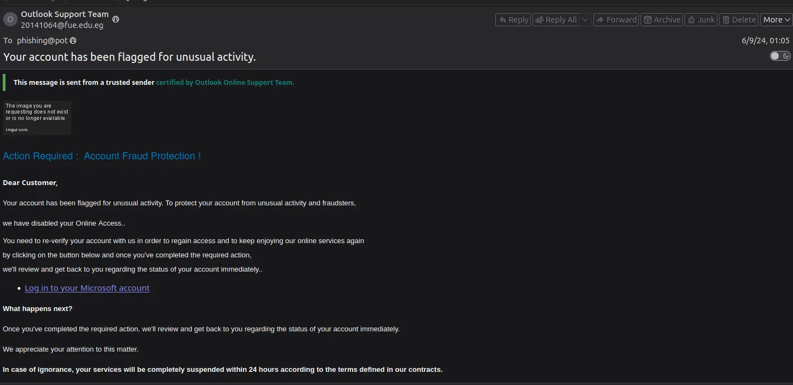

# Phishing Email Analysis

This repository documents the forensic analysis of a phishing email sample (`sample-3333.eml`).

The goal is to extract **indicators of compromise (IoCs)**, analyze message headers and body content, inspect embedded URLs, and provide a short technical report with defensive recommendations.

---
## 📑 Full Report

For the detailed Report see [REPORT.md](REPORT.md).


---

## Sample Source

The `.eml` file was downloaded from [rf-peixoto/phishing_pot](https://github.com/rf-peixoto/phishing_pot), a community-driven repository of phishing email submissions:

```bash
wget https://raw.githubusercontent.com/rf-peixoto/phishing_pot/main/email/sample-3333.eml

```
---
## Analysis summary

**Quick verdict:** credential phishing attempt (impersonates Microsoft/Outlook, uses shortened/redirected links to host a fake login page).

**High-level findings:**

- False authority and urgency language in the email body.
- Mismatched sender domain (`fue.edu.eg`) and claimed sender (Outlook Support).
- Use of a shortened URL that redirected to `pagedemo.co` (a generic hosting provider).
- No malicious attachments in this sample.

**Key IoCs**

- Sender: `20141064@fue.edu.eg`
- Message-ID: `6LRbA0LTveohBvLkwkPUOjSWatOYs2XlZkNlxXfiQ@vultr`
- Sender IP / Resolve host: `40.107.95.90` → `mail-dm3nam02on2090.outbound.protection.outlook.com`
- URLs:
    - `http://a.to/24U0Ifm`
    - `https://euintfarecenter.pagedemo.co/?id=h9bd2112sq`
---

## Analysis Process

### Step 1  Initial Review

- Opened the email in **Thunderbird**.



The email body utilized several classic phishing indicators:

- **False Authority:** The inclusion of "This message is sent from a **trusted sender certified by Outlook Online Support Team**" is a direct attempt to gain trust. The placement of this text *within the email body* (not an official header/banner) is highly suspicious.
- **Urgency/Call-to-Action:** The subject line ("Your account has been flagged for **unusual activity**.") and the body's prompt for "Action Required" are designed to create panic and bypass critical thinking.
- **Mismatched Link:** Hovering over the "Log in to your MS account" hyperlink revealed a shortened URL, immediately indicating the link's true destination was masked.

### Step 2  IOC Extraction

Used [MalwareCube/Email-IOC-Extractor](https://github.com/MalwareCube/Email-IOC-Extractor):

```bash
python3 eioc.py sample-3333.eml
```

This produces IPs, URLs, headers, and attachment hashes (if present).


Additionally, the raw `.eml` was manually inspected in Sublime Text to double-check headers.

- Interesting header:
    
    ```
    X-Mailer: PHPMailer 6.6.5 (https://github.com/PHPMailer/PHPMailer)
    ```
    
    → Indicates use of a PHP mailer script, not an Outlook client.
    

### Step 3  Header Analysis

| Field | Value |
| --- | --- |
| **Date** | Sat, 8 Jun 2024 11:05:51 -0900 |
| **Subject** | Your account has been flagged for unusual activity |
| **From** | Outlook Support Team [20141064@fue.edu.eg](mailto:20141064@fue.edu.eg) |
| **Return-Path** | [20141064@fue.edu.eg](mailto:20141064@fue.edu.eg) |
| **Sender IP** | 40.107.95.90 → mail-dm3nam02on2090.outbound.protection.outlook.com |
| **Message-ID** | 6LRbA0LTveohBvLkwkPUOjSWatOYs2XlZkNlxXfiQ@vultr |

Observations:

- Legitimate-looking IP belongs to Microsoft infrastructure, but the **From** domain (`fue.edu.eg`) is an Egyptian university, unrelated to Outlook Recovery.
- Likely a case of **abused legitimate infrastructure** (compromised account or open relay).
- **Subject**
    
    ```
    Your account has been flagged for unusual activity.
    ```
    
    High-urgency financial/security theme.
    
- **From**
    
    ```
    Outlook Support Team <20141064@fue.edu.eg>
    ```
    
    **Impersonation:**
    
    Mismatch between the claimed sender (Outlook) and the actual sending domain (
    
    ```
    fue.edu.eg
    ```
    
    The Egyptian university domain is likely **compromised or configured to allow open relay** for the attacker.
    
- **X-Mailer**`PHPMailer 6.6.5`**Technical Clue:**
    
    The email was scripted using a PHP library, confirming it was *not* sent by a legitimate Outlook/Exchange mail client, as would be expected from a support team.
    

### Step 4  URL Analysis

- Extracted URLs:
    
    ```
    http://a.to/24U0Ifm
    https://euintfarecenter.pagedemo.co/?id=h9bd2112sq
    ```
    
- Findings:
    - The first URL was a **shortened link**.
    - Resolved destination: `pagedemo.co` → a generic web hosting provider, not Microsoft.
    - At the time of analysis, the phishing site had already been reported/removed.

### Step 5 Artifact Cross-Checks

- No malicious attachments found in this sample.
- If attachments were present:
    - Extract hashes (MD5/SHA1/SHA256).
    - Submit to VirusTotal / internal sandbox.
    - Block via EDR policy.

---

## Artifact Analysis

### Sender Analysis

- Claimed sender: *Outlook Support Team*.
- Actual sender: `20141064@fue.edu.eg` (Egyptian university).
- Domain mismatch → strong phishing indicator.

### URL Analysis

- Shortened and redirected URLs used to mask phishing page.
- Final landing page hosted on `pagedemo.co`, unrelated to Microsoft services.

---

## Verdict

This email is a **credential phishing attempt**:

- Impersonates Microsoft Outlook recovery notifications.
- Uses social engineering (*“Action Required”*).
- Relies on link obfuscation (shortened URL → fake Outlook login).
- Likely distributed through compromised legitimate mail infrastructure.

---

## Defense Actions

If this email were received in production:

1. **Containment**
    - Quarantine the malicious email from all inboxes.
    - Block sender domain `fue.edu.eg` temporarily (pending validation).
    - Add malicious URLs/domains to proxy/EDR blocklists.
2. **Eradication**
    - Force password resets for any user who clicked the link.
    - Search logs for `POST` requests to the phishing site.
3. **Recovery**
    - Restore affected accounts.
    - Remove any persistence (if malware was dropped).
4. **User Education**
    - Use this email as an internal training example.

---
**Recommended tools**
- MalwareCube/Email-IOC-Extractor — `eioc.py`
- Text editor (Sublime / Vim) — raw `.eml` inspection
- `whois`, `dig`, `host` — basic domain/IP lookups
- URL expansion / URL scanning: `curl -I`, `urlunshorten`, urlscan.io, VirusTotal
- Sandbox & static tools (if attachments exist): Cuckoo, Any.Run, oledump.py, pdf-parser.py, Hybrid-Analysis

*Note:* We could have also used some automated tools like Phishtool, checkphish, but I did not here to demonstrate a mostly manual process depending on what the email contained and what I encountered.


---
Contribution & Contact

If you find additional IoCs or improvements to this analysis, please reach-out to me.
This repository and report are for demonstration & learning purposes. If I missed a deeper step or you want me to expand a section (attachment sandbox results, EDR playbook, or SOAR automation), please reach out or raise an issue — happy to iterate.
